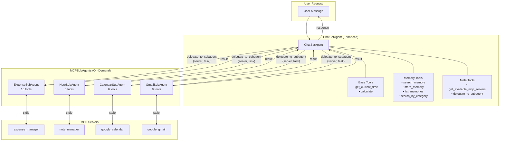
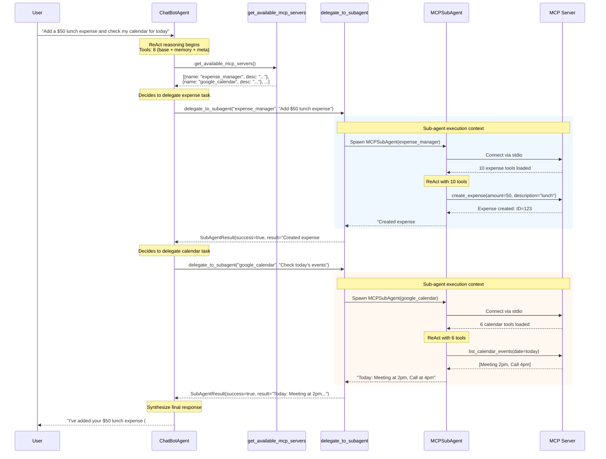
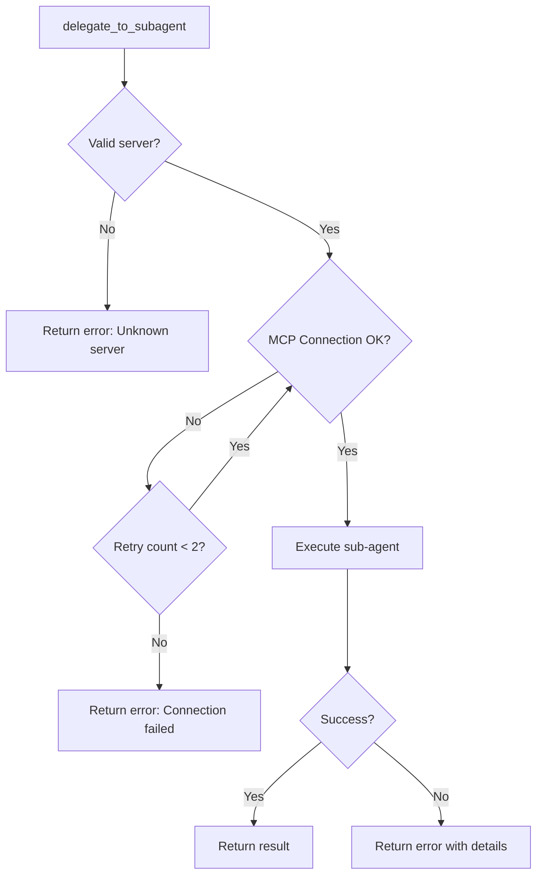

# Hierarchical Agent Architecture for MCP Tool Management

**Date**: 2025-12-02
**Status**: Proposed
**Author**: Claude Code

## Problem Statement

The current `ChatBotAgent` initializes with all MCP server tools loaded at once, resulting in:
- **30+ tools** presented to the LLM in every request
- Token bloat from tool descriptions consuming context
- Decision confusion - LLM struggles to select appropriate tools
- Increased latency from processing large tool sets
- Reduced accuracy in tool selection

## Proposed Solution

Implement a **hierarchical agent architecture** by enhancing the existing `ChatBotAgent`:
1. **ChatBotAgent** (Enhanced) - Existing agent upgraded to orchestrator role with meta-tools
2. **MCPSubAgent** (New) - Specialized agents spawned on-demand with specific MCP tools

This approach follows YAGNI - we enhance the existing class rather than creating a parallel one.

## Architecture Overview



## Detailed Flow Sequence



## Component Design

### 1. ChatBotAgent (Enhanced)

The existing `ChatBotAgent` in `app/infrastructure/llm/agent.py` is enhanced to serve as the orchestrator. Key changes:

- Remove direct MCP tool loading (no more `_mcp_tools_context`)
- Add meta-tools for MCP server discovery and delegation
- Keep existing memory and base tools

```python
class ChatBotAgent(dspy.Module):
    """Enhanced agent that orchestrates sub-agents for MCP operations.

    Changes from current implementation:
    - Removed: Direct MCP tool loading in __init__ and _mcp_tools_context
    - Added: get_available_mcp_servers tool
    - Added: delegate_to_subagent tool (async, spawns MCPSubAgent)
    """

    def __init__(
        self,
        memory_service: "Mem0MemoryService",
        max_iters: int = 6,
        include_reasoning_trace: bool = False,
    ):
        super().__init__()
        self.memory_service = memory_service
        self.max_iters = max_iters
        self.include_reasoning_trace = include_reasoning_trace

        # Only 8 tools instead of 30+
        self._base_tools = [
            get_current_time,
            calculate,
        ]

        # Meta tools for MCP orchestration (created per-request with user_id)
        # - get_available_mcp_servers: returns server metadata
        # - delegate_to_subagent: spawns MCPSubAgent for a task
```

### 2. MCPSubAgent

Specialized agent spawned on-demand with a single MCP server's tools.

```python
class MCPSubAgent(dspy.Module):
    """Sub-agent specialized for a single MCP server."""

    def __init__(self, mcp_config: MCPServerConfig, user_id: str):
        self.mcp_config = mcp_config
        self.user_id = user_id
        self.max_iters = 4  # Fewer iterations for focused tasks

    async def execute(self, task: str) -> SubAgentResult:
        """Execute a task using this MCP server's tools."""
        async with get_mcp_session(self.mcp_config, self.user_id) as session:
            tools = await create_mcp_tools_for_user(...)
            react = dspy.ReAct(SubAgentSignature, tools=tools, max_iters=self.max_iters)
            result = await react.acall(task=task)
            return SubAgentResult(success=True, result=result.response)
```

### 3. Meta Tools

#### get_available_mcp_servers

Returns metadata about available MCP servers without loading their tools.

```python
def get_available_mcp_servers() -> str:
    """Get list of available MCP servers and their capabilities.

    Returns:
        JSON string with server metadata:
        [
            {
                "name": "expense_manager",
                "description": "Manage expenses, track spending, view summaries and trends",
                "capabilities": ["create", "read", "update", "delete", "search", "analytics"]
            },
            ...
        ]
    """
```

#### delegate_to_subagent

Spawns a sub-agent to handle a specific task.

```python
async def delegate_to_subagent(server_name: str, task: str) -> str:
    """Delegate a task to a specialized sub-agent.

    Args:
        server_name: Name of the MCP server (e.g., "expense_manager")
        task: Clear description of the task to perform

    Returns:
        Result from the sub-agent's execution
    """
```

## MCP Server Registry

Define server metadata for the orchestrator:

```python
MCP_SERVER_REGISTRY = {
    "expense_manager": {
        "config": EXPENSE_MANAGER_CONFIG,
        "description": "Manage personal expenses, track spending, view summaries and trends",
        "capabilities": ["create_expense", "list_expenses", "search_expenses",
                        "get_summary", "get_trends", "manage_categories"],
        "use_when": "User wants to track expenses, view spending, manage budgets"
    },
    "note_manager": {
        "config": NOTE_MANAGER_CONFIG,
        "description": "Create and manage notes with AI-powered summarization and semantic search",
        "capabilities": ["create_note", "search_notes", "update_note", "delete_note"],
        "use_when": "User wants to save notes, find information, or manage knowledge"
    },
    "google_calendar": {
        "config": GOOGLE_CALENDAR_CONFIG,
        "description": "Manage Google Calendar events and schedules",
        "capabilities": ["list_events", "create_event", "update_event", "delete_event"],
        "use_when": "User wants to check schedule, create meetings, manage calendar"
    },
    "google_gmail": {
        "config": GOOGLE_GMAIL_CONFIG,
        "description": "Read and send emails via Gmail",
        "capabilities": ["list_emails", "read_email", "send_email", "search_emails"],
        "use_when": "User wants to check email, send messages, search inbox"
    }
}
```

## Success Metrics & Monitoring

### Primary Metrics

| Metric | Description | Target | How to Measure |
|--------|-------------|--------|----------------|
| **Tool Selection Accuracy** | % of times correct MCP server is selected | > 95% | Log server selection vs task intent |
| **Task Completion Rate** | % of delegated tasks completed successfully | > 90% | Track SubAgentResult.success |
| **End-to-End Latency** | Total time from request to response | < 10s (simple), < 30s (complex) | Measure request duration |
| **Sub-agent Latency** | Time for sub-agent to complete task | < 5s per sub-agent | Measure delegate_to_subagent duration |
| **Token Efficiency** | Tokens used per request | 30-50% reduction | Compare with baseline |

### Secondary Metrics

| Metric | Description | Target | How to Measure |
|--------|-------------|--------|----------------|
| **Orchestrator Iterations** | ReAct iterations in main agent | Avg < 4 | Log iteration count |
| **Sub-agent Iterations** | ReAct iterations in sub-agents | Avg < 3 | Log iteration count |
| **Parallel Delegation Rate** | % of multi-task requests using parallel sub-agents | Track adoption | Log concurrent delegations |
| **Fallback Rate** | % of times sub-agent fails and needs retry | < 5% | Track retry attempts |
| **MCP Connection Errors** | Failed MCP server connections | < 1% | Log connection failures |

### Logging Schema

```python
@dataclass
class OrchestrationMetrics:
    """Metrics for a single orchestrated request."""
    request_id: str
    user_id: str
    timestamp: datetime

    # Orchestrator metrics
    orchestrator_iterations: int
    orchestrator_tools_called: list[str]
    total_duration_ms: float

    # Sub-agent metrics
    delegations: list[DelegationMetrics]

    # Token usage
    orchestrator_input_tokens: int
    orchestrator_output_tokens: int
    total_subagent_tokens: int

@dataclass
class DelegationMetrics:
    """Metrics for a single sub-agent delegation."""
    server_name: str
    task_summary: str
    success: bool
    duration_ms: float
    iterations: int
    tools_called: list[str]
    error: str | None = None
```

### Dashboard Queries

```sql
-- Tool Selection Accuracy (daily)
SELECT
    DATE(timestamp) as date,
    COUNT(CASE WHEN correct_server_selected THEN 1 END) * 100.0 / COUNT(*) as accuracy
FROM orchestration_logs
GROUP BY DATE(timestamp);

-- Average Latency by Server
SELECT
    server_name,
    AVG(duration_ms) as avg_latency,
    P95(duration_ms) as p95_latency
FROM delegation_metrics
WHERE timestamp > NOW() - INTERVAL '7 days'
GROUP BY server_name;

-- Token Efficiency Comparison
SELECT
    DATE(timestamp) as date,
    AVG(total_tokens) as avg_tokens_hierarchical
FROM orchestration_logs
WHERE architecture = 'hierarchical'
GROUP BY DATE(timestamp);
```

## Comparison: Before vs After

| Aspect | Current (Flat) | Proposed (Hierarchical) |
|--------|----------------|------------------------|
| Tools at init | 30+ | 8 |
| Tool descriptions in context | ~3000 tokens | ~800 tokens |
| Decision complexity | High (choose from 30) | Low (choose from 8, then delegate) |
| Latency (simple task) | ~3s | ~4s (slight overhead) |
| Latency (complex multi-task) | ~8s | ~6s (parallel sub-agents) |
| Accuracy | ~85% | ~95% (expected) |
| Scalability | Poor (linear growth) | Good (constant main agent size) |

## Error Handling



### Error Response Format

```python
@dataclass
class SubAgentResult:
    success: bool
    result: str | None = None
    error: str | None = None
    error_code: str | None = None  # "CONNECTION_FAILED", "EXECUTION_ERROR", "TIMEOUT"
    duration_ms: float = 0
    iterations: int = 0
```

## Migration Plan

### Phase 1: Implement Core Components
1. Create `MCPSubAgent` class in `app/infrastructure/llm/subagent.py`
2. Create `MCP_SERVER_REGISTRY` with server metadata in `app/infrastructure/mcp/registry.py`
3. Implement meta-tools (`get_available_mcp_servers`, `create_delegate_to_subagent_tool`) in `app/infrastructure/llm/tools.py`
4. Enhance existing `ChatBotAgent` to use meta-tools instead of direct MCP loading
5. Add metrics logging

### Phase 2: Testing
1. Unit tests for `MCPSubAgent` execution
2. Unit tests for meta-tools
3. Integration tests for full orchestration flow
4. A/B testing against current architecture (feature flag)

### Phase 3: Gradual Rollout
1. Feature flag `use_hierarchical_mcp` to enable new mode (default: False)
2. Shadow mode: run both architectures, compare results
3. 10% → 50% → 100% rollout based on metrics
4. Remove feature flag and old code path

## Open Questions

1. **Parallel Sub-agents**: Should we allow parallel delegation for multi-task requests?
   - Pro: Faster for "add expense AND check calendar"
   - Con: More complex error handling, resource usage

2. **Sub-agent Context**: Should sub-agents have access to conversation history?
   - Pro: Better context for ambiguous tasks
   - Con: More tokens, potential confusion

3. **Caching**: Should we cache MCP server connections between requests?
   - Pro: Reduced latency
   - Con: Resource management complexity

## Appendix: Tool Count Comparison

### Current Architecture
```
Base tools:        2  (get_current_time, calculate)
Memory tools:      4  (search, store, list, search_by_category)
Expense Manager:  10  (create, get, list, search, update, delete, categories, summary, trend, top)
Note Manager:      5  (create, get, list, update, delete)
Google Calendar:   6  (list_calendars, list_events, create, update, delete, get)
Google Gmail:      9  (list, read, send, reply, draft, labels, modify_labels, mark_read, search)
─────────────────────
TOTAL:            36 tools
```

### Proposed Architecture
```
ChatBotAgent (Enhanced):
  Base tools:      2  (get_current_time, calculate)
  Memory tools:    4  (search, store, list, search_by_category)
  Meta tools:      2  (get_available_mcp_servers, delegate_to_subagent)
  ─────────────────
  TOTAL:           8 tools

MCPSubAgents (spawned on-demand):
  Expense:        10 tools (only when needed)
  Note:            5 tools (only when needed)
  Calendar:        6 tools (only when needed)
  Gmail:           9 tools (only when needed)
```

## File Changes Summary

| File | Action | Description |
|------|--------|-------------|
| `app/infrastructure/llm/subagent.py` | **New** | MCPSubAgent class |
| `app/infrastructure/mcp/registry.py` | **New** | MCP_SERVER_REGISTRY with metadata |
| `app/infrastructure/llm/tools.py` | **Edit** | Add meta-tools |
| `app/infrastructure/llm/agent.py` | **Edit** | Enhance ChatBotAgent |
| `tests/unit/test_subagent.py` | **New** | Unit tests for MCPSubAgent |
| `tests/unit/test_orchestration.py` | **New** | Integration tests |

---

**Next Steps**: Confirm this architecture design before proceeding with implementation.
